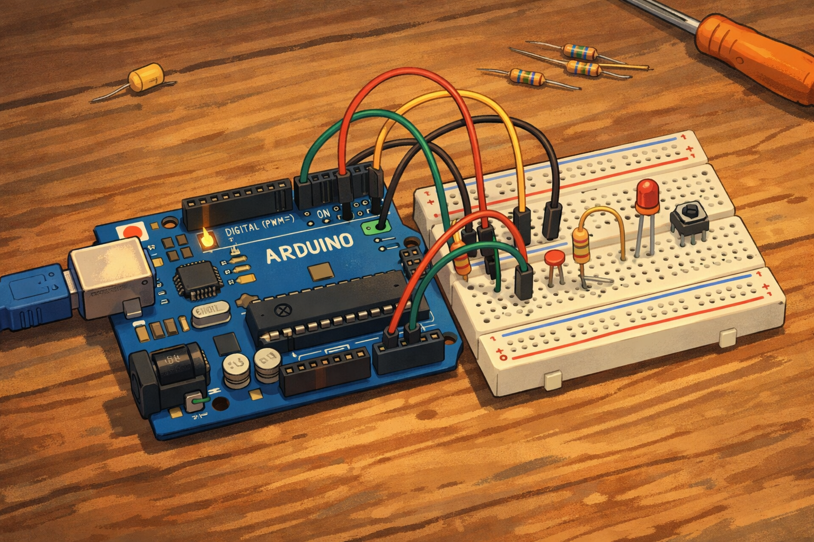

# Arduino Projects Hub

Bem-vindo ao repositório **Arduino Projects Hub**! Aqui você encontrará projetos criativos de Arduino desenvolvidos e testados por mim e meus amigos.

  

## Sobre o repositório

Este repositório contém projetos colaborativos que incluem:

- **Código-fonte comentado** para facilitar o aprendizado  
- **Esquemas de ligação** para protoboard  
- **Notas e explicações** sobre funcionamento e melhorias possíveis  
- Experimentos com **LEDs, sensores, speakers** e outras automações simples  

O objetivo é aprender, compartilhar conhecimento e inspirar novas ideias em eletrônica e programação com Arduino.

